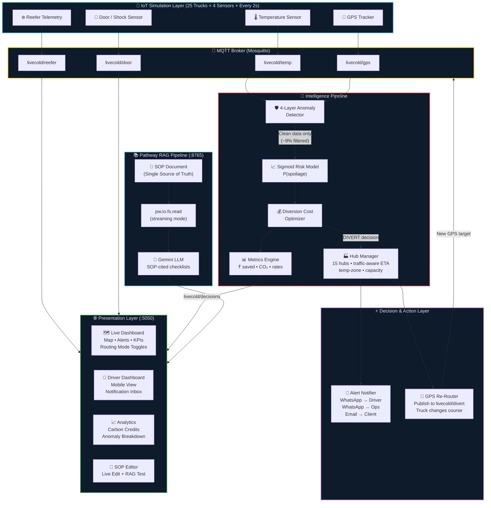
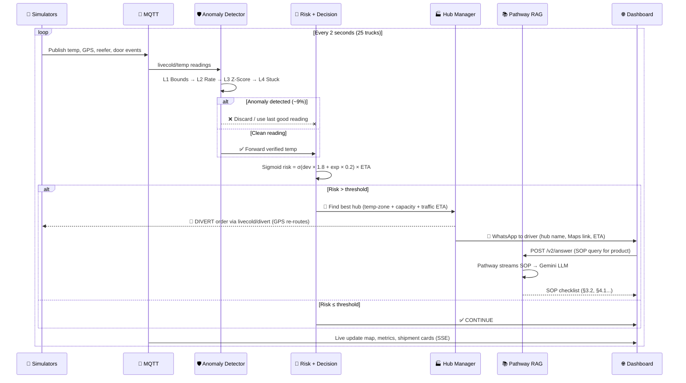

<div align="center">

# 🧊 LiveCold

### Real-Time Cold Chain Intelligence Platform

**AI-powered monitoring • Autonomous diversion decisions • Live SOP compliance**
**Built on [Pathway](https://pathway.com/) real-time streaming framework**

[]()
[](https://pathway.com/)
[]()
[]()
[]()
[]()

---

**India loses ₹92,000 Crore annually in cold chain failures.**
LiveCold prevents this with real-time AI that monitors, predicts, decides, and acts — in milliseconds.

[Features](#-features) · [Architecture](#-system-architecture) · [Quick Start](#-quick-start) · [How It Works](#-how-it-works) · [API Reference](#-api-reference)

</div>

---

## 🎯 What LiveCold Does

LiveCold is an **end-to-end cold chain intelligence platform** that goes beyond monitoring — it **thinks and acts**:

```
❌ Traditional: Sensor → Alert → Human reads email → Manual decision → Cargo already spoiled

✅ LiveCold:    Sensor → Anomaly Filter → Risk Model → Cost Optimizer → Auto-Divert → Driver notified in 2 seconds
```

| Capability | Description |
|-----------|-------------|
| 🌡️ **4-Stream IoT Monitoring** | Temperature, GPS, reefer telemetry, and door/shock events — 25 trucks streaming every 2 seconds |
| 🛡️ **4-Layer Anomaly Detection** | Filters sensor glitches *before* they trigger false decisions (physical bounds, rate-of-change, z-score, stuck sensor) |
| 🧠 **Sigmoid Risk Model** | Probability-based risk scoring — not binary IF/ELSE rules |
| 💰 **Cost-Benefit Diversion** | Compares `expected cargo loss` vs `diversion cost` — only diverts when economically rational |
| 🏭 **Intelligent Hub Matching** | 15 Indian hubs filtered by temp-zone compatibility, capacity, and traffic-aware ETA |
| 🔀 **Live GPS Re-Routing** | Diverted trucks physically change course on the map toward the assigned hub |
| 📲 **Interactive Notifications** | Drivers receive diversion proposals and must ACCEPT before GPS re-routing |
| 📄 **Pathway RAG Pipeline** | Edit the SOP → AI learns it in 2 seconds → answers cite updated §sections |
| 🌿 **Carbon Credits Engine** | Calculates CO₂ saved from prevented food waste, converts to ₹ credits |
| ⚖️ **Per-Shipment Routing Modes** | SAFETY / BALANCED / ECO — configurable mid-journey with bidirectional MQTT sync |

---

## 🏗️ System Architecture



---

## 🔄 Data Flow



---

## ⚡ How It Works

### The Story of a Shipment

**1. Departure** — 25 trucks leave cities across India carrying vaccines, dairy, seafood, frozen meat, and more. Temperature ranges come from the **SOP document** — the single source of truth.

**2. Anomaly Filtering** — A sensor reads -999°C? Our **4-layer filter** catches it instantly:

| Layer | What It Catches | Action |
|-------|----------------|--------|
| L1: Physical Bounds | Impossible temps (500°C, -999°C) | ❌ Discard |
| L2: Rate-of-Change | Sensor faults (20°C jump in 2s) | 🔄 Use last good reading |
| L3: Z-Score | Statistical outliers (3.5σ from mean) | 🔄 Use rolling mean |
| L4: Stuck Sensor | 10 identical readings | ⚠️ Flag for maintenance |

**3. Risk Calculation** — Clean data enters the sigmoid risk model:
```
risk = σ(deviation × 1.8 + exposure × 0.2) × ETA_factor
```

**4. Diversion Decision** — Cost optimizer compares:
```
Expected Loss (Continue) = P(spoilage) × Cargo Value     = ₹6,96,000
Total Divert Cost        = Fuel + Residual Risk × Value  = ₹1,596

₹6,96,000 > ₹1,596 → DIVERT ✅  (Net saving: ₹6,94,404)
```

**5. Hub Selection** — Not just "nearest" — the **smartest** hub. 5 filters:
- ✅ Available (not in maintenance)
- 🌡️ Correct temperature zone (Ultra-Cold for vaccines, Chilled for dairy)
- 📦 Has capacity (available tonnes > cargo weight)
- 🚗 Best traffic-aware ETA (congestion zones for Delhi, Mumbai, Bangalore...)
- 🔧 Repair station capability (for anomaly-triggered alerts)

**6. Action & Driver Acceptance** — Driver gets a dashboard notification with the proposed hub, Google Maps link, and ETA. The truck only diverts *after* the driver clicks **Accept** on their interactive mobile dashboard. The main dashboard updates live.

---

## 🎛️ Three Routing Modes

Each shipment gets a routing mode that changes how the diversion optimizer behaves:

| Mode | Default For | Behavior |
|------|------------|----------|
| 🛡️ **SAFETY** | Vaccines, Pharmaceuticals | Nearest hub always, ignore cost |
| ⚖️ **BALANCED** | Dairy, Seafood, Frozen Meat, Ice Cream | Optimize cost vs. safety |
| 🌿 **ECO** | Fruits, Flowers | Minimize CO₂, accept longer detours |

Modes can be **changed mid-journey** by the operations manager. The change syncs bidirectionally between dashboard and pipeline via MQTT.

---

## 📚 Pathway Integration — Real-Time RAG

LiveCold uses **Pathway** as the core streaming framework for live document intelligence:

```python
# Pathway watches SOP files in real-time (streaming mode)
documents = pw.io.fs.read(
    path="./watched_docs/",
    format="binary",
    mode="streaming",      # ← Detects file changes automatically
    with_metadata=True,
)

# REST API accepts natural language queries
queries, response_writer = pw.io.http.rest_connector(
    host="0.0.0.0", port=8765,
    route="/v2/answer",
    schema=QuerySchema,
)

# LLM reads FRESH SOP content on every query
results = queries.select(result=build_answer(queries.prompt))
```

**The magic:** Edit the SOP file → Pathway detects the change → Next query automatically uses updated content → Answer cites the new §sections. **No restart. No redeployment. 2-second latency.**

---

## 🚀 Quick Start

### Prerequisites
- Python 3.11+
- Mosquitto MQTT broker
- Google Gemini API key

### Local Setup

```bash
# 1. Clone & setup
git clone https://github.com/di35117/Pathway-Hackathon.git
cd Pathway-Hackathon
git checkout Tarun

# 2. Create virtual environment
python3.11 -m venv .venv-slim
source .venv-slim/bin/activate
pip install -r requirements-slim.txt

# 3. Configure
echo "GOOGLE_API_KEY=your_gemini_key" > .env

# 4. Start MQTT broker
mosquitto -c mosquitto.conf -d

# 5. Launch (3 terminals)
python main.py mqtt         # Terminal 1: Intelligence Pipeline
python main.py dashboard    # Terminal 2: Dashboard (http://localhost:5050)
python main.py sim-all      # Terminal 3: All 4 IoT Simulators

# Optional: Pathway RAG Pipeline
python main.py rag-v2       # Terminal 4: RAG API (http://localhost:8765)
```

### Docker

```bash
echo "GOOGLE_API_KEY=your_gemini_key" > .env
docker-compose up -d
# Dashboard: http://localhost:5050
```

### Access Points

| Service | URL |
|---------|-----|
| 🌐 Main Dashboard | http://localhost:5050 |
| 📱 Driver Dashboard | http://localhost:5050/driver/SHP_1 |
| 📈 Analytics | http://localhost:5050/analytics |
| 📄 SOP Editor | http://localhost:5050/sop-editor |
| 📚 RAG API | http://localhost:8765/v2/answer |
| ❤️ Health Check | http://localhost:5050/health |

---

## 📡 API Reference

### Pathway RAG — SOP Q&A

```bash
curl -X POST http://localhost:8765/v2/answer \
  -H "Content-Type: application/json" \
  -d '{"prompt": "What should I do if dairy temperature exceeds 8°C?"}'
```

### Dashboard APIs

| Endpoint | Method | Description |
|----------|--------|-------------|
| `/api/shipments` | GET | All 25 active shipments with live state |
| `/api/alerts` | GET | Recent DIVERT + door open alerts (last 50) |
| `/api/metrics` | GET | System-wide KPIs (₹ saved, CO₂, diversions) |
| `/api/stream` | GET | Server-Sent Events for real-time updates |
| `/api/hubs` | GET | All 15 cold storage hubs with status |
| `/api/nearest-hubs/<id>` | GET | 3 nearest compatible hubs for a shipment |
| `/api/history/<id>` | GET | Temperature history + 30-min prediction |
| `/api/analytics` | GET | Carbon credits, anomaly breakdown, financials |
| `/api/anomalies` | GET | Global + per-shipment anomaly detection stats |
| `/api/notifications` | GET | All WhatsApp/email notification log |
| `/api/shipment-report/<id>` | GET | Full compliance report for a shipment |
| `/api/routing-mode/<id>` | GET/POST | Get or change routing mode (SAFETY/BALANCED/ECO) |
| `/api/sop-content` | GET/POST | Read or edit the SOP document |
| `/api/rag-query` | POST | Query SOP via RAG (with LLM fallback) |
| `/api/sop-status` | GET | SOP sync status (last modified, change count) |

---

## 📂 Project Structure

```
hack/
├── main.py                         # 🎮 Unified CLI (rag, dashboard, mqtt, sim-all, etc.)
│
├── pipeline/
│   └── livecold_pipeline.py        # 🧠 Central brain: MQTT → Anomaly → Risk → Decision → Publish
│
├── decision_engine/
│   ├── evaluator.py                # Orchestrator: risk → diversion → metrics
│   ├── risk_model.py               # Sigmoid P(spoilage) calculator
│   ├── diversion_optimizer.py      # Cost vs loss optimizer (supports cost/eco modes)
│   └── metrics_engine.py           # ₹ saved, CO₂ delta, diversion rates
│
├── anomaly_detector.py             # 🛡️ 4-layer anomaly filter (267 lines of defense)
├── hub_manager.py                  # 🏭 15 hubs, traffic-aware ETA, temp-zone matching
├── alert_notifier.py               # 📲 WhatsApp + Email notifications (3 conditions)
├── sop_parser.py                   # 📄 Reads temp ranges from SOP (single source of truth)
│
├── sim/
│   ├── shipment_factory.py         # 🏭 25 shipments with scripted demo scenarios
│   ├── temp_simulator.py           # 🌡️ Temperature with drift/stable/critical modes
│   ├── gps_simulator.py            # 📍 GPS with live diversion re-routing
│   ├── reefer_simulator.py         # ❄️ Compressor status, power draw, cycles
│   ├── door_simulator.py           # 🚪 Door open/close + shock events
│   └── config.py                   # 20 Indian cities, MQTT topics, intervals
│
├── pathway_rag_pipeline_v2.py      # 📚 Pathway streaming RAG (pw.io.fs.read + REST)
├── pathway_metrics_pipeline.py     # 📊 Pathway metrics aggregation
├── pathway_integrated_full.py      # 🔗 Full integrated Pathway pipeline
│
│   ├── dashboard/
│   │   ├── app.py                      # 🌐 Flask server (1061 lines, 20+ routes)
│   │   └── templates/
│   │       ├── index_1.html            # Main dashboard (map + alerts + metrics)
│   │       ├── driver_1.html           # 📱 Interactive mobile driver dashboard
│   │       ├── analytics_1.html        # 📈 Carbon credits + anomaly analytics
│   │       └── sop_editor_1.html       # 📄 Live SOP editor + RAG tester
│
├── watched_docs/
│   └── cold_chain_SOP.txt          # 📋 SOP document (10 sections, 399 lines)
│
├── Dockerfile                      # 🐳 Multi-component Docker image
├── docker-compose.yml              # Full stack with Mosquitto
├── requirements-slim.txt           # Python dependencies
└── mosquitto.conf                  # MQTT broker config
```

---

## 🔧 Configuration

| Variable | Default | Description |
|----------|---------|-------------|
| `GOOGLE_API_KEY` | — | Primary Gemini API key (required for RAG) |
| `GOOGLE_API_KEY_2` | — | Backup API key (auto-rotates on rate limit) |
| `MQTT_HOST` | `localhost` | MQTT broker hostname |

---

## 📊 Live Demo Metrics (25 shipments)

| Metric | Value |
|--------|-------|
| 🚚 Active Shipments | 25 across 20 Indian cities |
| 🌡️ Sensor Events/Second | ~50 |
| 🚨 Diversions Triggered | 15-17 within first 30 seconds |
| 🛡️ Anomalies Filtered | ~9% of readings (zero false diversions) |
| 💰 Cargo Value Monitored | ₹2.71 Cr |
| 💰 Cargo Saved | ₹1.5+ Cr |
| 🌿 CO₂ Impact Tracked | 170+ kg |
| 🏭 Hub Database | 15 hubs across India |
| 📦 Product Types | 9 (Vaccines, Meat, Dairy, Seafood, Vegetables, Fruits, Pharma, Ice Cream, Flowers) |

---

## 🛠️ Tech Stack

| Layer | Technology |
|-------|-----------|
| **Real-Time Streaming** | [Pathway](https://pathway.com/) — `pw.io.fs.read`, `pw.io.http.rest_connector`, UDFs |
| **LLM** | Google Gemini 2.5 Flash (via LiteLLM, with 5-model fallback chain) |
| **Message Broker** | Eclipse Mosquitto (MQTT) |
| **Backend** | Flask + paho-mqtt |
| **Frontend** | Leaflet.js (maps) + Server-Sent Events + Vanilla JS |
| **Anomaly Detection** | Custom 4-layer engine (physical bounds, rate-of-change, z-score, stuck sensor) |
| **Risk Model** | Sigmoid-based probability with exposure tracking |
| **Containerization** | Docker + Docker Compose |

---

## 🏆 Key Differentiators

1. **Math-based, not rule-based** — Sigmoid risk probability, not `IF temp > threshold`
2. **Smartest hub, not nearest** — Traffic-aware ETA with congestion zone modeling
3. **Actual re-routing** — GPS simulator physically moves trucks to diversion hubs
4. **Live document intelligence** — Edit the SOP, AI learns it in 2 seconds via Pathway streaming
5. **Zero false diversions** — 4-layer anomaly filter catches sensor glitches before the risk model
6. **Economically rational** — Every ₹1 spent on diversion is justified by ₹10+ in prevented loss
7. **Sustainable** — Carbon credits calculated for every prevented waste event
8. **Production-ready patterns** — Thread-safe state, API key rotation, rate-limit handling, dedup logic

---

## 👥 Team

Built for the **Pathway Real-Time AI Hackathon** — demonstrating real-time streaming intelligence for India's cold chain logistics.

---

## 📄 License

MIT
